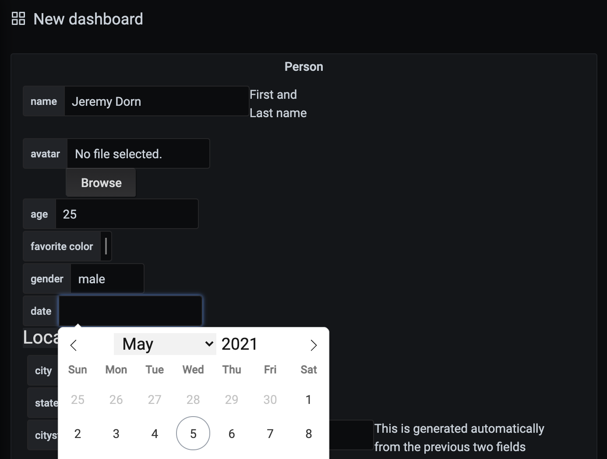

# JSON Schema Form for Grafana

JSON schema form plugin for Grafana.



## Feature

- Simple form creation (supports json or urlencoded post)
- File upload (via `json-editor` upload handler)
  - More details: [fileupload.md](./fileupload.md)
- Submit confirmation

## Installation

You can clone or download the repository directly into the plugin directory.

## Development

```sh
npm install
npm run build
```

## License

MIT
