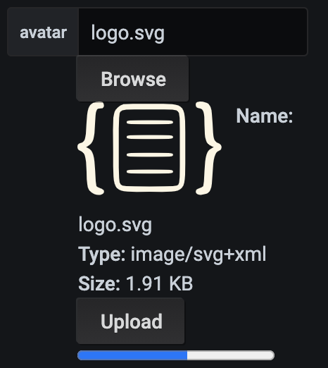

# File Upload

Upload handler defines for file upload (for example, converts url pass to server).
We use `json-editor` for the form render engine, upload handler set to `JSONEditor.defaults.callbacks.upload`.

Example:
[https://json-editor.github.io/json-editor/upload.html](https://json-editor.github.io/json-editor/upload.html)

You can define the upload handler in panel settings:

**IMPORTANT:** You have to write your own code for upload handler in your production environment.

```js
{
  "testUploadHandler" : function (jseditor, type, file, cbs) {
    if (type === 'root.upload_fail') cbs.failure.call(jseditor, 'Upload failed');
    else {
      var tick = 0;
      var tickFunction = function() {
        tick += 1;
        console.log('progress: ' + tick);
     
        if (tick < 100) {
          cbs.updateProgress.call(jseditor, tick);
          window.setTimeout(tickFunction, 50)
        } else if (tick == 100) {
          cbs.updateProgress.call(jseditor);
          window.setTimeout(tickFunction, 500)
        } else {
          cbs.success.call(jseditor, 'http://www.example.com/images/' + file.name);
        }
      };
     
      window.setTimeout(tickFunction)
    }
  }
}
```

And then, use it in property options:

```js
{
  ...
  "options": {
    "upload": {
      "upload_handler": "testUploadHandler"
    }
  }
}
```

## Example

```js
    ...
    "avatar": {
      "type": "string",
      "format": "url",
      "options": {
        "upload": {
          "upload_handler": "testUploadHandler"
        }
      }
    },
    ...
```


